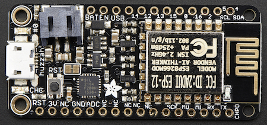
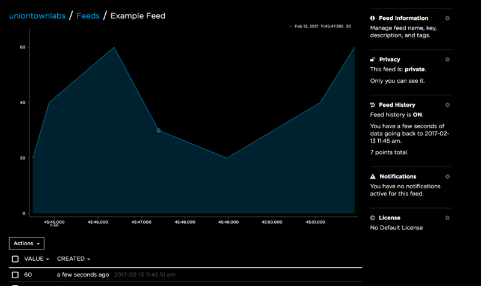

# Microcontroller with WIFI

In this speedcourse we will connect a Microcontroller to the internet to decide what color LED it should show.


## What you will need

- [Adafruit Feather Huzzah ESP8266 board](https://learn.adafruit.com/adafruit-feather-huzzah-esp8266?view=all)
- Localhost or online PHP server



## Steps

- Installing drivers and Arduino
- Connecting to WIFI
- Connecting to your own PHP page
- Connecting the RGB LED
- Using the PHP RGB value for the LED
- Creating a color picker

## Installing drivers and Arduino

Install [Arduino](https://www.arduino.cc)

Then, follow [these instructions](https://learn.adafruit.com/adafruit-feather-huzzah-esp8266/using-arduino-ide) to install the Feather board

 - Install CP2104 driver
 - Set the board manager url in Arduino
 - Install esp8266 library in Arduino
 - Connect Feather via MicroUSB
 - Set the BOARD and PORT settings in arduino
 - Copy>Paste the code from [Blink example](./feather/blinktest.ino) into Arduino, and upload to the Feather

## Connecting to WIFI

Create a new Arduino document and [copy>paste the code from the WIFI example](./feather/wifitest.ino).

Fill in the SSID and USERNAME for the wifi network you are connecting to.

Make sure the Wifi network allows IoT devices. You can set up a phone hotspot if your network does not allow this.

Test if the message from the adafruit website is displayed in the monitor: `If you can read this, it's working!` Make sure the BAUD of the serial monitor is **115200**.

## Connecting to your own PHP page

Create a simple PHP page that returns a color as a string:

```php
<?php
   echo "244,0,10";
```
### Using localhost

If your laptop is on the same WIFI as your Feather, you can use the IP address of your laptop to visit the PHP page from the Feather. Else you will have to host it online.

Paste the url of your PHP page in the Arduino code:

```arduino
const char* host = "http://192.168.2.8";
String url = "/test/rgb.php";
```

The Feather should now show `244,0,10` instead of the Adafruit welcome message!

## Connecting the RGB LED

Most RGB LEDs connect the long pin to GND. Some RGB LEDs need to connect the long pin to 3V. Test this out by connecting the RED and the LONG pins to 3V and GND. 


Try if the LED works. Make sure the three pin numbers are correct, and play around with the R,G,B values. This code displays RED. Note that the maximum value is 1024.

```arduino
void setup() {
  pinMode(14, OUTPUT);
  pinMode(12, OUTPUT);
  pinMode(13, OUTPUT);
}
void loop(){
  analogWrite(14, 1024);  // red
  analogWrite(12, 0);     // green
  analogWrite(13, 0);     // blue
  delay(1000);
}
```

## Using the RGB Led value

Instead of just printing to the serial monitor, the `line` variable should be passed to a RGB function:

```arduino
void loop() {
  // ... wifi code here
  Serial.println("closing connection");
  Serial.println(line);
  updateRGBLed(line);        // add this function call
}
```
And we'll create a function that can convert the string `"255,10,100"` to three numbers. Each number is then sent to one of the pins of the RGB LED!
```arduino
void updateRGBLed(String webColor) {
  webColor.replace(" ", "");
  webColor.replace("\n", "");
  int firstComma = webColor.indexOf(",");
  int secondComma = webColor.indexOf(",", firstComma + 1);
  String r = webColor.substring(0, firstComma);
  String g = webColor.substring(firstComma + 1, secondComma);
  String b = webColor.substring(secondComma + 1);
  // feather analog values go from 0 to 1024 instead of 0 to 255
  valueR = r.toInt() * 4;
  valueG = g.toInt() * 4;
  valueB = b.toInt() * 4;
  analogWrite(rpin, valueR);
  analogWrite(gpin, valueG);
  analogWrite(bpin, valueB);
}
```
Check the [complete code here!](./feather/feather_rgbled.ino)

## Creating a color picker

We will add a color picker that updates `rgb.php`, so anyone on the web can choose a color for the RGB LED!

Our [HTML page displays a basic color picker](./website.color.html) . When the user changes the color, we send the color value to the `saveajax.php` page.

```javascript
wheel.addEventListener("change", () => saveColor())

async function saveColor() {
    let color = wheel.value.replace("#", "")
    let response = await fetch("saveajax.php?favcolor=" + color)
    let success = await response.text()
    console.log(success)
    }
```

Then, `saveajax.php` saves the color value  in a local text file.

```php
$color = $r . "," . $g . "," . $b;
file_put_contents('color.txt', $color);
```

> Note: the textfile needs to have `777` write permissions!

And finally, our old `rgb.php` page will simply echo the contents of the text file.

```php
<?php
    $color = file_get_contents('color.txt');
    echo $color;
```

## Complete code

We are finished! The RGB light can now be changed by anyone who visits the color picker website.

- [Feather with RGB Led and WIFI](./feather/feather_rgbled.ino)
- [Color picker and PHP pages](./website)

<br>

# Sending sensor data to Adafruit IO



Instead of calling your own PHP page, you can send sensor data to Adafruit IO. This service will keep track of all the data that you send, and make it available as a feed for any other website.

- [Adafruit IO Tutorial](https://learn.adafruit.com/adafruit-io-basics-analog-output?view=all)

<br>

# Using the Feather as a server

Instead of sending data at intervals, we can set up the Feather as a server. Then it will wait until someone requests data from the internet.

- [ESP8266 Server Example](https://arduino-esp8266.readthedocs.io/en/latest/esp8266wifi/server-examples.html)

<br>

# Links

- [Arduino](https://www.arduino.cc)
- [Order the Feather Huzzah board](https://www.adafruit.com/product/2821)
- [Installing the Feather Huzzah board](https://learn.adafruit.com/adafruit-feather-huzzah-esp8266?view=all)
- [Wifi Library Documentation (ESP8266)](https://arduino-esp8266.readthedocs.io/en/latest/)
- [Client Example](https://arduino-esp8266.readthedocs.io/en/latest/esp8266wifi/client-examples.html)
- [Server Example](https://arduino-esp8266.readthedocs.io/en/latest/esp8266wifi/server-examples.html)
- [Adafruit IO](https://learn.adafruit.com/adafruit-io-basics-analog-output?view=all)
- [Save data to a text file with PHP](https://www.w3schools.com/php/func_filesystem_file_put_contents.asp)